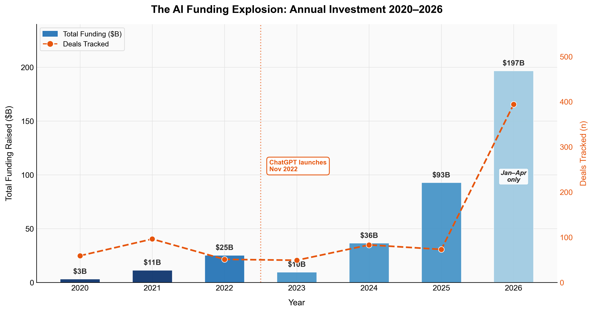
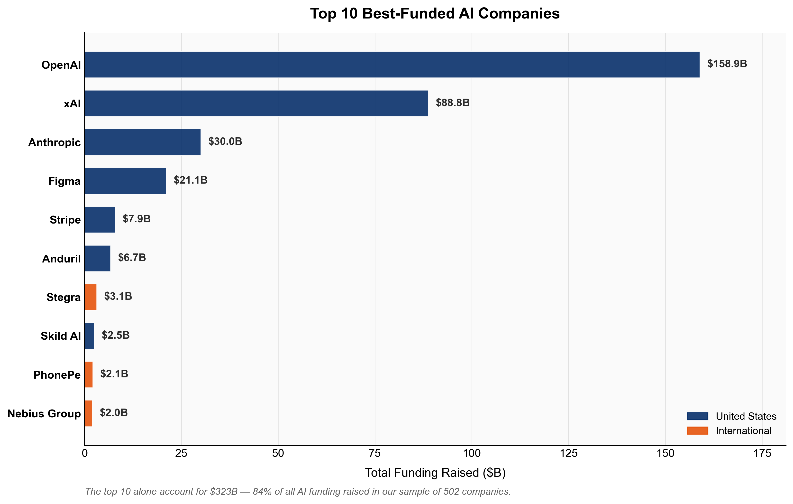
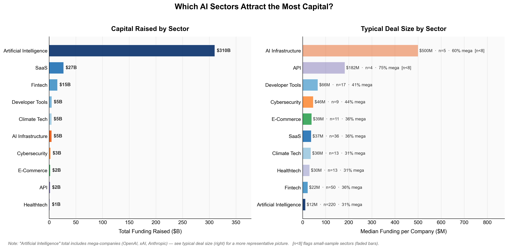
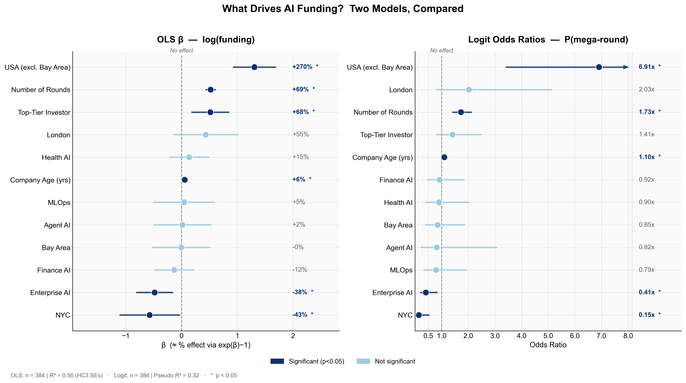
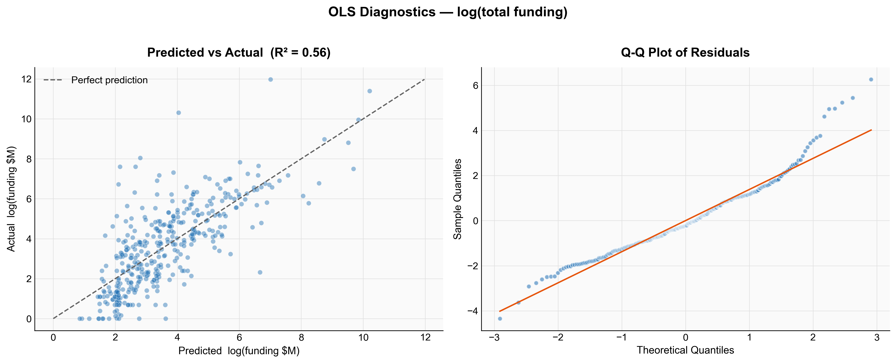
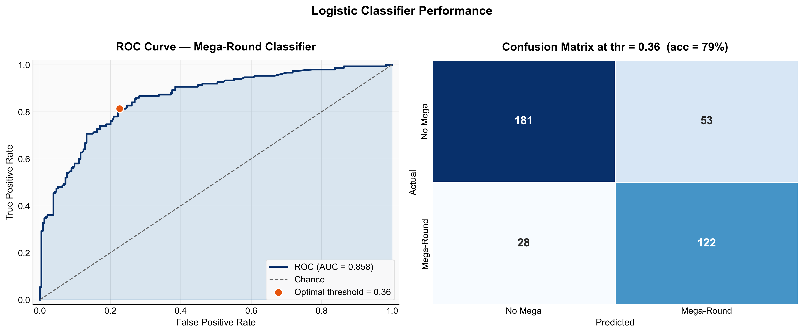

In the first four months of 2026, AI startups raised $197 billion, more than the entirety of 2025. To put that into perspective, the same figure in 2020 was just $3 billion. Something fundamental has changed about how capital flows into the AI space, and the numbers don’t seem to be stopping anytime soon.

But these aggregate numbers only tell part of the story. Behind the headline totals sits a finer story of where the money goes, who it’s going to, and why. Is the Bay Area premium real? Do top-tier investors really move the needle, or do they simply pick winners that were already going to win? Which AI sectors are actually attracting funding, and which are being left behind?

To answer these questions, I scraped and cleaned data on 502 AI-adjacent companies across 40 countries, covering over 1,000 funding rounds from 2020 to 2026. The dataset spans everything from pre-seed rounds to OpenAI’s staggering $110 billion funding round, the largest in venture capital history. Alongside analysis, I ran two regression models to isolate which company characteristics genuinely predict funding outcomes, controlling for sector, age, location, and investor quality simultaneously.

What I found surprised me. The Bay Area premium that everyone assumes exists? It doesn’t, not once you control for simply being in the US. Enterprise AI, despite its enormous hype, receives lower funding than the baseline. And the single biggest predictor of raising a mega-round isn’t your sector, investors, or your founding team’s pedigree; it's your location.

## The Funding Explosion

{width=90% fig-align="center"}

Between 2020 and 2022, AI funding grew steadily: $3 billion, then $11 billion, then $25 billion. Investors appeared interested, but careful. Then came November 2022, and ChatGPT changed everything, but the money didn’t follow. In reality, 2023 saw funding collapse to $10 billion, the lowest figure in our sample. The technology was clearly transformative, but it did not trigger an immediate gold rush.

It didn’t last long. By 2024, funding had rebounded to $36 billion. In 2025, it more than doubled to $93 billion. And in just the first four months of 2026, AI startups have raised $197 billion, more than double all of 2025, with eight months yet to go.

Aggregate figures conceal as much as they reveal. By zooming in on which companies are actually receiving this capital, a striking concentration emerges: the 10 best-funded companies in our sample account for $323 billion, or 84% of all funding raised. Three companies alone, OpenAI, xAI, and Anthropic, represent the overwhelming majority of that figure.

{width=90% fig-align="center"}

This points to a structural reality that shapes everything else in this analysis: the AI funding market has been divided. On one side, a handful of core models raise tens of billions to train ever-larger models. On the other hand, the vast majority of the companies in our sample are application-layer startups raising $5-50 million to build products on top of these models. These are two very different markets; for the rest of this analysis, we keep both sides in view. However, it is worth remembering that when a single OpenAI round skews the chart, the interesting story is what lies beneath.

## Where in the World?

AI funding is global in reach but American in concentration. The United States accounts for 40% of companies in our sample and dominates the top of the table, with seven of the ten best-funded companies being headquartered there.

<iframe src="outputs/figures/03_geographic_map.html" 
        width="100%" height="500px" 
        style="border:none;">
</iframe>

Yet the deal count tells a different story. India contributes 15% of companies in our sample, the United Kingdom 11%, with meaningful clusters across Germany, France, the Nordics, and Israel. The geography of AI is not Silicon Valley and everywhere else; it is Silicon Valley at the top, and a global ecosystem beneath it.

Where you build your company still matters enormously. As we will see in the regression analysis, being in the US is the single largest predictor of funding success in our dataset.

It is worth noting that China, one of the world’s largest AI investment markets, is largely absent from this dataset, suggesting an English-language bias in the underlying data source rather than the reality of Chinese AI funding activity. 

## Which Sectors are Winning?

The chart below plots two views of the same data. On the left, total funding raised by the sector. On the right, median funding per company, a far more representative picture of what a typical startup in each sector can expect to raise.

{width=90% fig-align="center"}

The left panel is dominated by Artificial Intelligence, with $310 billion raised. However, it isn’t the winner. That figure is almost entirely made up of OpenAI, xAI, and Anthropic, distorting the total. Removing those three companies makes the category look far more ordinary. This is why median deal size matters more than aggregate totals when assessing where the real opportunities lie.

The right panel tells a much more interesting story. AI infrastructure companies have a median raise of $500 million per company, and API-focused businesses come second at $182 million. The individual companies in these sectors are attracting serious capital. If you are building the compute, APIs, and model-serving infrastructure, be prepared to raise big rounds.

The picture changes further down the list. Enterprise SaaS companies have a median raise of $37 million, Healthtech $30 million, and Fintech $22 million. These are competitive but not extreme figures, representing the fact that these markets contain many players competing for similar pools of capital.

AI Infrastructure and API both have fewer than eight companies in our dataset, so their median figures should be interpreted cautiously. The direction of the finding is likely real; the exact magnitude is less so.

The wider implication is stark: the layer of the AI stack you choose to build on is one of the most consequential funding decisions you will make. Infrastructure and foundational tooling attract an order of magnitude more capital per company than application-layer products. Whether that capital is available to a typical founding team is, of course, a separate question entirely.

## What Actually Predicts Funding Success?

The descriptive analysis tells us where the money has gone, but regression analysis asks the harder question: why?

To answer this, I ran two models on the 384 companies in our sample with complete data, excluding OpenAI, xAI, and Anthropic as extreme outliers that could distort the regression. The first model uses OLS to predict log(total funding), allowing us to interpret coefficients as approximate percentage effects. The second uses logistic regression to predict the probability of landing a mega-round, any single raise of $50 million or more. Both models control simultaneously for location, sector, investor quality, company age, and number of funding rounds.

{width=90% fig-align="center"}

The US premium is the dominant finding. Companies headquartered in the United States raise 270% more than equivalent international companies, controlling for everything else, and are 6.9 times more likely to land a mega-round. This is the single largest effect in the data, bigger than investor quality, sector, or company age. For any founder weighing where to incorporate, this finding is difficult to ignore.

The Bay Area result is the surprise. Controlling for other factors, being in the Bay Area specifically awards no statistically significant premium over the rest of the United States on either model. The convention that you must be in San Francisco to attract serious capital does not hold in this data. What matters is being in the US, not which part.
Top-tier investors add 68% to total funding, and this effect is statistically significant. But the causal interpretation requires care. Do top-tier investors cause companies to raise more, or do they simply identify companies that were already going to raise more? This regression cannot distinguish between the two. The association is real; the causality is unclear.

Each additional year of company age is associated with 6% more funding and 1.10 times the odds of a mega-round. The practical implication is reassuring: younger companies are not significantly penalised. A three-year-old startup is not at a meaningful disadvantage against a ten-year-old competitor, all else equal.

Companies categorised as enterprise AI raise 38% less than the baseline, and are only 0.41 times as likely to land a mega-round, both effects statistically significant. One interpretation is that the enterprise AI label has become so crowded and generic that it no longer signals differentiation to investors.

### Model Performance

{width=90% fig-align="center"}

{width=90% fig-align="center"}

Both models perform well for observational data of this type. The OLS model explains 56% of the variance in log(funding), a reasonable result given that much of what drives individual funding outcomes is unobservable to any dataset. The logistic classifier achieves an AUC of 0.858, correctly classifying 79% of companies at the optimal threshold. The Q-Q plot shows mild heavy tails in the residuals, expected with funding data, even after log-transformation.

## Conclusion

The AI funding boom is real and shows no sign of stopping. But the headline numbers conceal a more complex reality: a market that is increasingly divided, a handful of foundation model companies absorbing tens of billions at the top, and a long tail of application-layer startups competing for far more modest raises beneath them.

Geography is still a critical factor, but the relevant unit is not the Bay Area, as conventional wisdom suggests, but the United States as a whole. Once you control for other factors, San Francisco has no significant premium over the rest of the country. What matters is being in the US.

What I find most striking is what the regression reveals about the sectors. Enterprise AI, despite its hype, receives lower funding than the baseline. Structural factors such as investor network and the number of rounds are far more predictive of funding success than the category a company chooses for its pitch deck.

This analysis has limitations worth acknowledging. The dataset captures recent funding rounds but cannot speak to longer-run outcomes. Whether these companies will exit, IPO, or fail entirely is a question the data cannot yet answer, and a natural direction for future research.

The code, data, and full methodology behind this analysis are available in the [GitHub repository](https://github.com/eo409-exe/ai-funding-analysis).